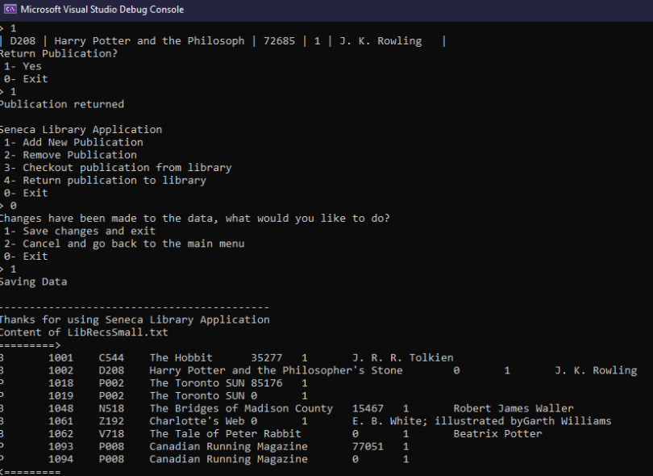

<!DOCTYPE html>
<html lang="en">
    <head>
        <meta charset="utf-8">
        <meta name="Tyler Arcila-Rakoczy" content="Tyler Arcila-Rakoczy">
        <meta name="viewport" content="width=device-width, initial-scale=1">
        <title>Personal Website</title>
        <link rel="stylesheet" href="./css/style.css" type="text/css">
        <link rel="preconnect" href="https://fonts.googleapis.com">
        <link rel="preconnect" href="https://fonts.gstatic.com" crossorigin>
        <link href="https://fonts.googleapis.com/css2?family=Archivo+Black&display=swap" rel="stylesheet">
        <link href="https://fonts.googleapis.com/css2?family=Montserrat:wght@600&family=Russo+One&display=swap" rel="stylesheet">
        <link href="https://fonts.googleapis.com/css2?family=Montserrat&display=swap" rel="stylesheet">
    </head>
    <body>
        

            <header>
                
                <h1 class="name">Tyler Arcila-Rakoczy</h1>
                
Web/Software Developer

                

                    <a href="./pdf/resume.pdf" download="Tyler_Arcila_Resume"><button class="resume">Resume</button></a>
                    <button class="contact">Contact Me</button>
                

            </header>
        

        <h2 class="experience-title">Experience</h2>
        

            

                
                <h3 class="title">WEB222 #3 Page</h3>
                
Includes multimedia elements, such as video, audio, and images!
                

            

            

                
                <h3 class="title">WEB222 #4 Page</h3>
                
A Nav menu that dynamically outputs products from the category assigned to the product!
                

            

            

                
                <h3 class="title">WEB222 #5 Page</h3>
                
 The design of all item info was turned into info cards!
                

            

            

                
                <h3 class="title">OOP244 Final</h3>
                
Created a library interface where a user can add, remove, checkout, and return books!
                

            

        

        

            

                <h4>About Me and Academic Honesty</h4>
                
I declare that my assessment is wholly my own work in accordance with Seneca Academic Policy. 
                    No part of this assessment has been copied manually or electronically from any other source 
                    (including websites) except for the information supplied by the WEB222 instructors and/or 
                    made available in this assessment for my use. I also declare that no part of this assignment has 
                    been distributed to other students
                

                
I have been attending Seneca for a year now. Previously, I took a year of computer engineering 
                    at Humber College, receiving dean's list both semesters. I also completed a semester in both Centennial (Software 
                    Engineering) and George Brown (Marketing). I have experience now in C, C++, Javascript, HTML/CSS, 
                    and SQL. I am currently starting my third semester, and at this point, I am developing a fondness for web 
                    development as a main focus for my career. Above, you will find some examples of my work, and below you will find
                    relevant college courses I have taken throughout my academic career. I am very excited 
                    to continue my journey and learn from many talented individuals!
                

                
<a href="https://github.com/TylerArcila">Click here</a> to go to my GitHub profile!

                
<a href="https://www.linkedin.com/in/tylerarcila/">Click here</a> to go to my Linkedin profile!

                
<b>Date:</b> Aug 18,2023

            

            

                    <h4>Basic Information</h4>
                    

                        
Name:

                        
Tyler Arcila-Rakoczy

                    

                    

                        
Age:

                        
23

                    

                    

                        
Email:

                        
tylerarcila@hotmail.com

                    

                    

                        
Language:

                        
English

                    

                    

                        
Class Section:

                        
NAA

                    

                    

                        
Student ID:

                        
100391184

                    

                    

                        
Instructor:

                        
Mark Meritt

                    

            

        

        

            <h2 class="education-title">Education</h2>
            <nav id="menu">
                <!-- Dynamically create your menu category buttons here -->
            </nav>
            <h5>All classes I have taken over my academic career</h5>
            <h2 id="selected-category">
            <!-- Dynamically update the selected category title -->
            </h2>
            <table class="class-info">
            <thead>
                <!-- Statically create the headings for your table here -->
                <tr>
                <th>Class Name</th>
                <th>Description</th>
                <th>Course Code</th>
                </tr>
            </thead>
            <tbody id="category-products">
                <!-- Dynamically create your product rows here -->
            </tbody>
            </table>
        

        

            <h2>Contact Me</h2>
            <form class="contact-form" action="https://httpbin.org/post" method="post">
                <label class="contact-name" for="name">Name:</label>
                <input type="text" id="name" name="name" required>  
                <label class="contact-email" for="email">Email Address:</label>
                <input type="email" id="email" name="email" required>  
                <label class="contact-address" for="address">Address:</label>
                <input type="text" id="address" name="address" required>  
                <label class="contact-city" for="city">City:</label>
                <input type="text" id="city" name="city" list="city-List" required>
                <datalist id="city-List">
                    <option value="Toronto"></option>
                    <option value="Vancouver"></option>
                    <option value="Montreal"></option>
                    <option value="Winnipeg"></option>
                    <option value="Calgary"></option>
                    <option value="Halifax"></option>
                    <option value="Edmonton"></option>
                </datalist>  
                <label class="contact-code" for="postalCode">Postal Code:</label>
                <input type="text" id="postalCode" name="postalCode" pattern="[A-Za-z]\d[A-Za-z] ?\d[A-Za-z]\d" required>  
                <label>Reason:</label>
                <input type="radio" id="questionRadio" name="reason" value="Question" required onclick="toggleHourlyRateInput()">
                <label for="questionRadio">Question</label>
                <input type="radio" id="commentRadio" name="reason" value="Comment" required onclick="toggleHourlyRateInput()">
                <label for="commentRadio">Comment</label>
                <input type="radio" id="hiringRadio" name="reason" value="Hiring" required onclick="toggleHourlyRateInput()">
                <label for="hiringRadio">Hiring</label>
                

                    <label class="contact-rate" for="hourlyRate">Hourly Rate:</label>
                    <input type="number" id="hourlyRate" name="hourlyRate" min="0" required>
                
  
                <label class="contact-message" for="message">Message:</label>
                <textarea id="message" name="message" rows="5" required></textarea>  
                <label class="contact-urgency" for="urgency">Urgency:</label>
                <input type="text" id="urgency" name="urgency" list="urgency-List" required>
                <datalist id="urgency-List">
                    <option value="Not"></option>
                    <option value="Low"></option>
                    <option value="Medium"></option>
                    <option value="High"></option>
                    <option value="Extreme"></option>
                </datalist>  
                <input type="submit" value="Submit">
            </form>
        

            <!-- JavaScript Data Files -->
            
            
            <!-- Main App JavaScript File -->
            
    </body>
</html>
